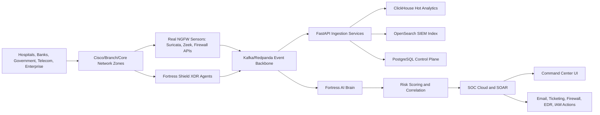

# Enterprise Architecture

## Network Architecture

- Bank sector: internet edge NGFW pair, DMZ, core banking segment, payment switch segment, SOC tap/SPAN, privileged admin network, SWIFT/HSM enclave.
- Hospital sector: clinical network, PACS/RIS, EHR, medical IoT VLANs, guest isolation, emergency services segment.
- Government sector: citizen services DMZ, ministry WAN, identity federation, classified enclaves, national CERT monitoring.
- Telecom sector: OSS/BSS, subscriber core, signaling security, lawful intercept separation, NOC/SOC shared telemetry.

Cisco-style design principles:

- Hierarchical campus core/distribution/access segmentation.
- VRF-lite or SD-WAN segmentation between sectors.
- NGFW inspection between trust zones, not only at the internet edge.
- NetFlow/IPFIX, SPAN/TAP, DNS, DHCP, VPN, IAM, and EDR telemetry into the event backbone.
- Microsegmentation enforced through Kubernetes NetworkPolicy, service mesh authorization, and firewall policy.

## Data Plane

- Kafka/Redpanda topics: `endpoint.telemetry`, `ngfw.logs`, `ids.alerts`, `dns.events`, `identity.events`, `cloud.audit`, `incidents`, `playbook.runs`.
- ClickHouse: high-volume analytics and packet/security metrics.
- OpenSearch: SIEM search, detection content, dashboards.
- PostgreSQL: tenants, policies, users, cases, playbooks, integrations.
- Redis: rate limits, live session state, short-lived correlation windows.

## Control Plane

- API gateway with OIDC, MFA/passkeys, tenant routing, rate limiting, and request signing.
- Istio mTLS between services.
- Vault-managed secrets and short-lived workload credentials.
- ArgoCD GitOps deployment with signed manifests.

