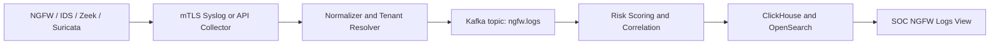

# Real NGFW Integration Guide

Nepal Fortress ONE can receive logs from real NGFW and network security tools through API collectors, syslog collectors, Kafka topics, or vendor APIs.

## Supported Sources to Add

- Suricata EVE JSON for IDS/IPS events.
- Zeek logs for protocol and metadata analysis.
- Palo Alto Networks traffic, threat, URL, WildFire, and system logs through syslog/API.
- Cisco Secure Firewall/FTD, ASA, NetFlow/IPFIX, and ISE identity context.
- Fortinet FortiGate traffic, UTM, IPS, application control, and web filter logs.
- Cloud firewall logs from AWS Network Firewall, Azure Firewall, and Google Cloud Firewall.

## Required Normalized Fields

- Tenant and sector: `tenant_id`, `sector`.
- Sensor: `sensor_id`, zone, interface, policy package.
- Flow: source/destination IP, ports, protocol, bytes, packets, session id.
- Application control: application, category, confidence, rule id, action.
- DPI: SNI, HTTP host, URI category, file type, hash, certificate metadata.
- IPS: signature id, signature name, CVE, ATT&CK technique, severity, blocked state.
- Threat intel: IOC match, feed, confidence, first seen, last seen.

## Production Collector Pattern

Collectors must validate device certificates, rate limit noisy sensors, preserve raw logs, and attach a cryptographic receipt for tamper evidence.

